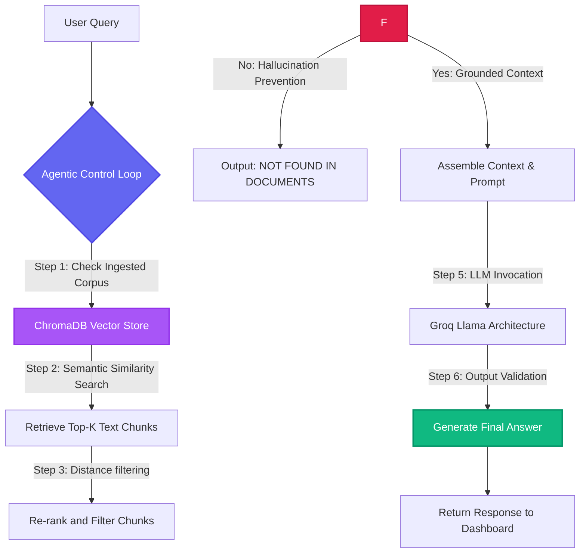

---
title: Agentic RAG Document Assistant
emoji: 🤖
colorFrom: indigo
colorTo: purple
sdk: docker
app_file: ui.py
python_version: "3.11"
pinned: false
----


# 🤖 Agentic RAG Document Assistant

An advanced, highly structured, and custom-styled **Retrieval-Augmented Generation (RAG)** pipeline. This application reads a variety of document formats, builds semantic vector indexes, retrieves context-relevant snippets, and leverages Large Language Models (LLMs) with strict factual grounding rules to eliminate hallucinations.

---

## 📸 Key Features

* **⚡ Ultra-Fast Groq Architecture**: Utilizes Groq's high-speed inference engine for sub-second text completions.
* **📂 Dynamic Multi-Format Parser**: Built-in loaders for **PDFs**, **DOCXs**, **TXTs**, **CSVs**, and **XMLs**.
* **🚀 Dual-Interface Orchestrator**: Run either a modern **Streamlit Web UI** or an interactive **CLI Chat** directly through `main.py`.
* **🔍 Real-Time Semantic Inspector**: Deep-dive developer inspection tab visualizing raw vector chunks, file sources, and exact similarity confidence scores.
* **💡 One-Click Demo Mode**: Skip file-upload setups with an integrated, highly informative demo document on Agentic RAG.
* **🛡️ Zero-Hallucination Guardrails**: Employs a strict grounding loop that prevents the model from answering unless backed by source facts.

---

## 🛠️ System Architecture

Under this agentic pattern, the agent controls retrieval, assesses results, aggregates multiple sources, and enforces strict grounding rules to guarantee accurate outputs.



---

## 📁 Repository Structure

The workspace is structured cleanly as a professional Python modular project:

```bash
RAG/
├── data/                      # Data storage layers
│   ├── demo_files/            # 💡 Preloaded demo files for instant testing
│   │   └── agentic_rag_guide.txt
│   ├── uploaded_pdfs/         # 📁 Target directory for user-uploaded documents
│   └── vector_store/          # 🗄️ ChromaDB persistent database files
├── pipeline/                  # Modular backend pipeline
│   ├── agent/                 # Agentic validation & reasoning controls
│   │   └── agentic.py
│   ├── embeddings/            # Sentence-transformer embeddings generator
│   │   └── embedding_manager.py
│   ├── ingestion/             # File ingestion engines (PDF, DOCX, etc.)
│   │   └── pdf_loader.py
│   ├── llm/                   # Groq LLM wrapper integrations
│   │   └── groq_llm.py
│   ├── processing/            # Recursive character text splitting
│   │   └── text_splitter.py
│   ├── retrieval/             # Semantic vector similarity search
│   │   └── retriever.py
│   └── vectorstore/           # ChromaDB database configurations
│       └── chroma_store.py
├── research/                  # 🔬 Archive of Jupyter notebooks & experiments
├── .env                       # Environment credentials (e.g. GROQ_API_KEY)
├── .gitignore                 # Standard file ignore list
├── main.py                    # 🚀 Professional unified launcher CLI & UI
├── pyproject.toml             # Package metadata & build dependencies
├── requirements.txt           # Python library dependencies
└── ui.py                      # 🎨 Streamlit modern dashboard interface
```

---

## ⚙️ Quick Start Guide

### 1. Clone & Set Up Directory
```bash
git clone https://github.com/your-username/RAG-MODEL.git
cd RAG-MODEL
```

### 2. Configure Virtual Environment
Make sure you are using Python `>= 3.10`:
```bash
# Create virtual environment
python -m venv .venv

# Activate virtual environment
# On Windows (PowerShell/CMD):
.venv\Scripts\activate
# On macOS/Linux:
source .venv/bin/activate
```

### 3. Install Dependencies
```bash
pip install -r requirements.txt
```

### 4. Configure API Credentials
Create a `.env` file in the root directory and specify your Groq API Key:
```env
GROQ_API_KEY=gsk_your_groq_api_key_here
```
> [!NOTE]
> If you don't have a `.env` file or key configured on launch, the Web UI will let you input it dynamically and securely in the sidebar!

---

## 🚀 Execution Instructions

Launch everything from the core orchestrator file (`main.py`):

```bash
# Option A: Start the Orchestrator with an interactive launcher menu
python main.py

# Option B: Direct-launch the Streamlit Web Application
python main.py --ui

# Option C: Direct-launch the Terminal-based Interactive CLI Chat
python main.py --cli
```

---

## 🛠️ Core Technologies Under the Hood

* **Framework & UI**: Streamlit (Sleek dark/light responsive layout)
* **Document Parsers**: PyPDF (PDFs), TextLoader (TXTs), python-docx (DOCX), csv (CSV), ElementTree (XML)
* **Chunking Strategy**: LangChain `RecursiveCharacterTextSplitter` (Size: 500, Overlap: 50)
* **Embedding Model**: `SentenceTransformer("all-MiniLM-L6-v2")` (384-dimensional dense vectors)
* **Vector Database**: **ChromaDB** (Persistent, local serverless store)
* **Inference Pipeline**: **Groq API** (Llama-3.1 architecture, latency < 0.5s)